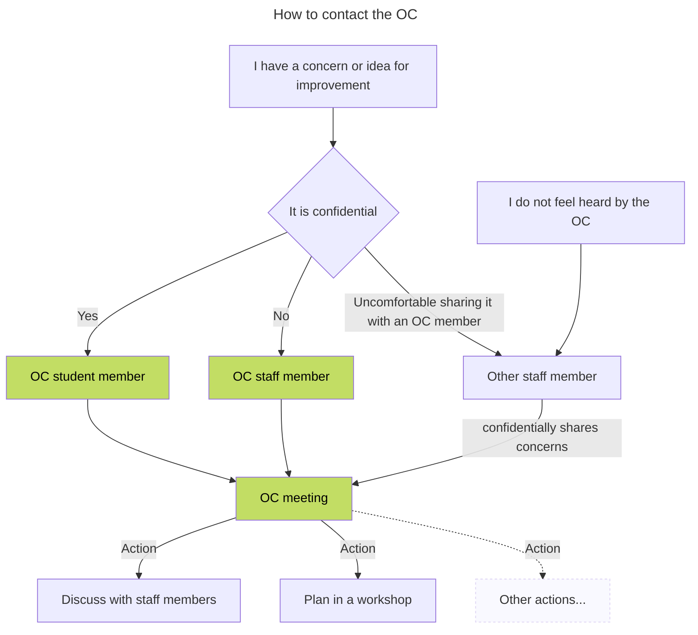

In this documentation you will find all matters discussed during the meetings of the OC. The OC is a group of students and teachers that tries to meet every 4 weeks to discuss the program and the quality of the education. More information about an OC within the HvA can be found [on the HvA website](https://www.hva.nl/praktisch/algemeen/faculteiten/fmr/opleidingscommissies/opleidingscommissies-fmr.html).

